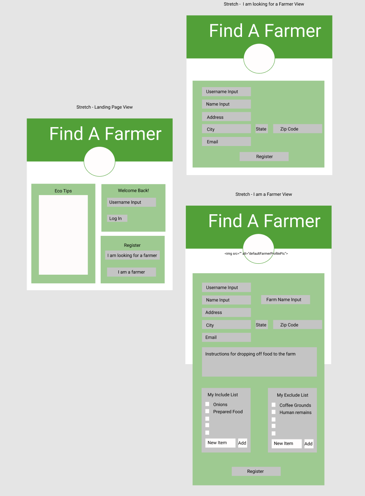

# Find A Farmer

Find A Farmer is designed for those in Middle TN who want to address the 
environmental issues around food waste, but for any number of reasons 
cannot compost some, or any of their food waste. It will share the 
locations of farmers who (1) opted in to the program and (2) have pigs 
that can eat just about anything. The environmentally savvy users will 
have the option to feed their waste to the pigs, thus keeping food waste 
from going to landfills, while helping the farmer supply the pigs with a 
nutritious diet.

## Table of Contents
* [Project Requirements and Features List](#project-requirements-and-features-list)
* [Technologies Used](#technologies-used)
* [Installing and Launching Find A Farmer](#instructions-for-installing-find-a-farmer)
* [Appendix 1: Planning Documentation](#appendix-1-planning-documentation)
    * [Entity Relationship Diagrams](#entity-relationship-diagram)
    * [Wireframes](#wireframes)
 * [Appendix 2: Set Up Instructions](#appendix-2-set-up-instructions)
 
## Project Requirements and Features List
### Two Types of Users

Users are offered two registration options. If they are not a farmer, they
register with just their name, username, email, profile picture and zip code.
As a farmer, they also are required to fill out information on their farm,
including the address, website (if applicable), and their farm's name.

### Get Started
When a user registers an account, or logs in from a previously registered
account, they are shown a list of all of the farms in the Middle TN area
that have opted into Find A Farmer. The are given the option to find a farm
in their preferred county, and then shown a list of only farms in that area.
They can then choose an individual farm to learn more about.

### Farm Details
When the user has selected a farm, they are shown the farm's address, the
instructions provided for dropping off their food waste, a list of items 
they are welcome to include, and a list of items they are asked to exclude.
They are given reviews for that farm, listed from most recent to least 
recent, and the option to add their own review. Last, they are also given 
the option to go back to the list of all of the farms.

### Farm Review
When the user has clicked on the 'Add Review' button (on either the farm
details page, or from the list of farms), they are taken to a form that
allows them to write their own review. The title of the review includes
the name of the farm, so they can confirm they're reviewing the correct
farm. They are asked to give their review a title, the date they visited,
and the review itself. Once they submit their review, they are redirected
to the details page of the farm they have just reviewed.

### Edit and Delete Review
Users are given the option to edit or delete the reviews that they have
written.


## Technologies Used

### Development Languages and Libraries


### Development Tools

   
 
  


## Instructions for Installing Find A Farmer
To launch the Simplified Supper app, you will need to have access to 
command line tools, node package manager, JSON Server. If you do not 
have access to any of these tools, you can find instructions for 
installing them in the Appendix.

Clone this repo on you personal machine using the following command
```sh
  git clone git@github.com:jessicadever1/findAFarmer.git
 ```
  
Install the NPM dependencies for this project using the following commands
```sh
  cd find-a-farmer
  npm install
 ```
 
From your terminal window, type
```sh
  npm start
```

Now that the server is up and running, you can open an internet browser 
and access the application
```sh
  http://localhost:8014/
```
### Congratulations you are now experiencing Find A Farmer!


## Appendix 1: Planning Documentation

  ### Entity Relationship Diagram
  

  ### Wireframes
  </img> 
  
  </img>
  

## Appendix 2: Set Up Instructions

  You will need to have command line tools installed for your computer 
  to use terminal commands.

  Linux/ Windows users, please visit the [Git page](https://git-scm.com/book/en/v2/Getting-Started-Installing-Git) and follow the instructions for set up

  Mac users follow the instructions below

  Open your terminal and type
  ```sh
    git --version
  ```

  You will now need to configure your git account. In the terminal window, type:
  ```sh
    git config -global user.name "Your Name"
    git config -global user.email "Your Email"
  ```

  If you do not have Node.js installed on your machine, visit the [Node.js Download Page](https://nodejs.org/en/download/) and  follow the instructions. To ensure that it is installed correctly, in your terminal window, type
  ```sh
    echo $PATH
  ```
  Ensure that the result has the following in the $PATH
  ```sh
    /usr/local/bin
    or
    /usr/local/bin:/usr/bin:/bin:/usr/sbin:/sbin
  ```

  Now you can follow the [installation instructions](#instructions-for-installing-Find-A-Farmer) 
  to get Find A Farmer up and running on your machine.

